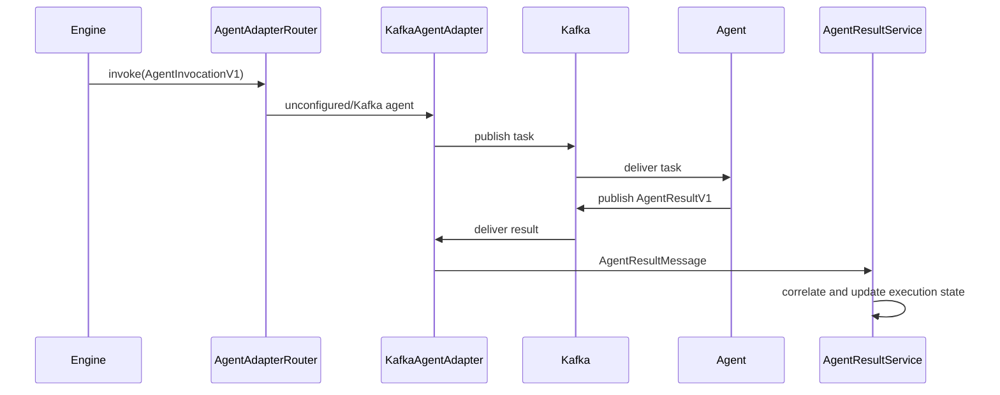

# AgentAdapter

## Purpose

`AgentAdapter` separates orchestration behavior from the runtime used to
dispatch work and receive results. The Orchestrator binds the interface to
`AgentAdapterRouter`, which selects `KafkaAgentAdapter` or `HttpAgentAdapter`
by exact configured agent name. This supports asynchronous transports without
teaching `EngineService` about their clients,
addresses, serialization, or delivery metadata.

## Boundary

The application layer creates `AgentInvocationV1`, requests asynchronous
dispatch, processes `AgentResultV1`, and owns execution state, retries,
timeouts, duplicate handling, and DAG progression.

The adapter layer owns transport lifecycle and result delivery. Kafka topics,
message keys, JSON serialization, consumer records, partitions, and offsets do
not cross into application decisions. Transport metadata is optional and is
used only for logging and diagnostics. Neither dispatch receipts nor transport
metadata contain invocation input, prompts, credentials, or raw Kafka records.

## Interface

- `start(handler)` starts the adapter and registers the asynchronous result
  handler. Repeated calls after a successful start are no-ops.
- `stop()` closes adapter resources. Repeated calls after a successful stop are
  no-ops.
- `invoke(invocation)` validates and dispatches an `AgentInvocationV1`; it does
  not wait for agent completion.
- `AgentResultHandler` receives an `AgentResultMessage` containing the canonical
  `AgentResultV1` and optional scalar transport metadata.
- `AgentDispatchReceipt` reports adapter kind, invocation ID, dispatch time,
  and an optional message key or transport-neutral dispatch ID. It does not
  cause a state transition.
- `AgentAdapterError` distinguishes lifecycle, serialization, dispatch, and
  handler failures from `ContractValidationError`. It exposes a stable code and
  retryable classification while retaining the internal cause without copying
  sensitive transport details into its public message.

Invoking the Kafka adapter before `start()` produces retryable
`ADAPTER_NOT_STARTED`. Kafka publish failures are retryable
`DISPATCH_FAILED`; serialization failures are non-retryable
`SERIALIZATION_FAILED`.

## Kafka implementation

`KafkaService` is the low-level infrastructure wrapper for connect, disconnect,
publish, and subscribe operations. `KafkaAgentAdapter` owns all agent-specific
Kafka behavior:

The values below are preserved Kafka runtime-v1 compatibility identifiers, not
active Tenvyr branding.

- task topics remain `agentweave.agent.<agent>.task`;
- the task message key remains `executionId`;
- result topics remain `agentweave.agent.<agent>.result`;
- configured result topics still come from `ORCHESTRATOR_AGENT_NAMES` and
  `ORCHESTRATOR_RESULT_TOPICS`;
- invocations are validated immediately before JSON serialization;
- v1 results are validated directly, while legacy results resolve the persisted
  step execution before deterministic normalization;
- Kafka key, topic, partition, and offset are mapped to scalar optional
  metadata; the raw consumer record is never exposed.

KafkaJS configuration is unchanged, including its built-in producer retry
behavior. The adapter does not add an application-level retry. Dispatch errors
continue into the existing Engine failure/retry policy.

`AgentAdapterLifecycle` is the sole Nest lifecycle owner. On module startup it
starts `AgentAdapterRouter` with `AgentResultService.handle`; the router starts
both concrete adapters and cleans up partial startup. On shutdown it
best-effort stops both. Infrastructure, concrete adapters, and the router do
not independently implement Nest lifecycle hooks.

HTTP agents use the callback-first protocol documented in
[`http-agent-adapter.md`](./http-agent-adapter.md). Agents without an exact
HTTP mapping continue to use Kafka.

## Data flow

## Compatibility

- Kafka topic names and agent names are unchanged.
- Task writers still emit the same `AgentInvocationV1` fields and deterministic
  `<stepExecutionId>:<attempt>` invocation ID.
- Agent result writers still emit `AgentResultV1`.
- The Orchestrator still accepts legacy results and resolves their persisted
  step execution before normalization.
- Database schema, pipeline DAG behavior, retry attempts, timeout enforcement,
  and failure policies are unchanged.
- Existing code-reviewer and observability agents require no adapter-specific
  business changes.

## Extension path

Additional transports must implement the same `start`, `stop`, asynchronous
`invoke`, and canonical-result delivery contract. Selection belongs in the
composition/router layer; protocol details must not introduce transport
branches into `EngineService` or `AgentResultService`.
