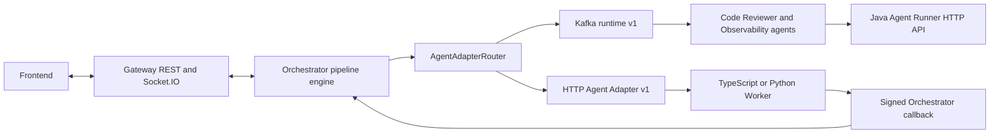

# System Architecture Overview

Tenvyr is a framework-neutral execution control plane. The Orchestrator owns
pipeline state and dispatches versioned agent invocations through a
transport-neutral adapter boundary. Agent runtimes execute work and return a
canonical result without taking ownership of pipeline progression.

## Current execution paths

For Kafka, the Orchestrator creates `AgentInvocationV1`, routes it through
`KafkaAgentAdapter`, and publishes to the preserved agent-specific task topic.
The specialized agent may call the Java Agent Runner, then publishes
`AgentResultV1` to its result topic. `KafkaAgentAdapter` validates or
normalizes the result and hands it to `AgentResultService`.

For HTTP, the Orchestrator submits `HttpAgentRunRequestV1` to a statically
configured Worker and requires `202 Accepted`. The Worker executes
asynchronously and posts one signed `AgentResultV1` callback. Both transports
converge at `AgentResultService`; transport metadata does not drive business
state.

## Operational events and supervision

Workers can also emit `AgentEventV1` operational events (`accepted`,
`progress`, `log`, `heartbeat`, `artifact`, `completed`, `failed`) over the
same signed callback channel or Kafka event topics. The Orchestrator stores
them as durable evidence per attempt, projects server-received liveness fields
(`acceptedAt`, last-event/heartbeat/progress timestamps), and exposes them
through `GET /executions/:id/events`. Deterministic, opt-in supervision
(`ORCHESTRATOR_SUPERVISION_CONFIG`) can terminalize attempts whose agent never
accepted or stopped heartbeating, using the persisted timestamps plus
configured durations. The authority split is unchanged: `AgentResult` remains
the only terminal authority; events are evidence that can never terminalize an
attempt by themselves. See the
[control plane](./control-plane.md#agentevents-and-supervision) for the full
semantics.

## Gateway and frontend

The Gateway exposes health, pipeline, execution, and internal execution-update
REST routes. It forwards pipeline and execution operations to the
Orchestrator. When the Orchestrator posts an execution-update webhook, the
Gateway fetches the current execution and broadcasts `execution-update` over
Socket.IO.

The current frontend can register a YAML pipeline, trigger a run, list and
select executions, show step input/output/error state, receive Socket.IO
updates, and poll a selected running execution every two seconds as a fallback.
It is not an observability/provenance dashboard and does not implement roadmap
capabilities such as traces, artifact lineage, or policy controls.

## Boundaries

- [Agent protocol v1](./contracts/agent-protocol-v1.md) defines the canonical
  invocation, result, event, HTTP request, and acceptance shapes.
- [Control plane](./control-plane.md) owns persistence, DAG progression,
  conditions, timeout, retry, and terminal transitions.
- [Adapter model](./transports/adapter-model.md) owns transport lifecycle,
  asynchronous dispatch, and result delivery into the application boundary.
- [Worker SDKs](./workers/typescript-worker-sdk.md) own local HTTP admission,
  execution, idempotency, callback delivery, and process-local lifecycle.

## Current limitations

There is no durable Worker queue, callback outbox, or Worker idempotency store.
The HTTP callback replay cache is also in memory. Worker-local event delivery
is likewise process-local; only Orchestrator-accepted events are durable
PostgreSQL evidence, and heartbeat supervision applies only to explicitly
configured agents. OpenTelemetry,
W3C propagation, artifact lineage, a policy engine, dynamic agent discovery,
and framework-specific integrations remain outside the current architecture.
