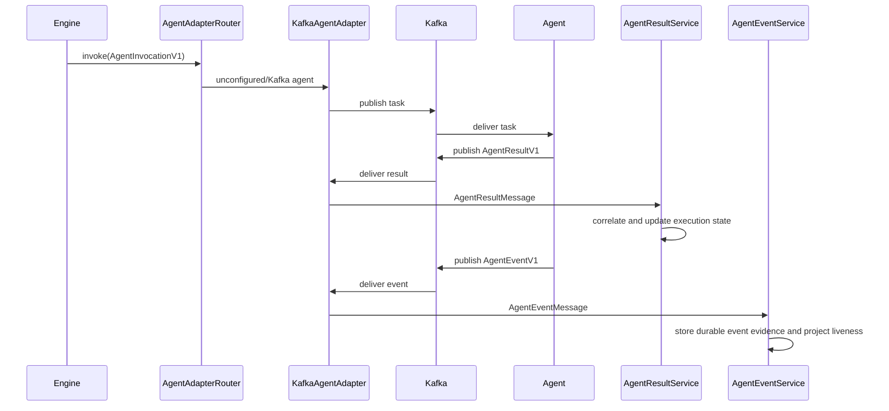

# Agent Adapter Model

## Purpose

`AgentAdapter` separates orchestration behavior from the runtime used to
dispatch work and receive results. The Orchestrator binds the interface to
`AgentAdapterRouter`, which selects `KafkaAgentAdapter` or `HttpAgentAdapter`
by exact configured agent name. This supports asynchronous transports without
teaching `EngineService` about their clients,
addresses, serialization, or delivery metadata.

## Boundary

The application layer creates `AgentInvocationV1`, requests asynchronous
dispatch, processes `AgentResultV1` and `AgentEventV1`, and owns execution
state, retries, timeouts, duplicate handling, supervision policy, and DAG
progression.

The adapter layer owns transport lifecycle, authentication, canonical
parsing, and inbound delivery. Adapters authenticate and parse canonical
protocol messages, attach safe scalar transport metadata, and call the
matching application handler; they never contain supervision/watchdog policy.
Kafka topics, message keys, JSON serialization, consumer records, partitions,
and offsets do not cross into application decisions. Transport metadata is
optional and is used only for logging and diagnostics. Neither dispatch
receipts nor transport metadata contain invocation input, prompts,
credentials, or raw Kafka records.

## Interface

`start(handlers)` starts the adapter and registers the application handler
seam `AgentAdapterHandlers`, which has exactly two members:

- `result: AgentResultHandler` receives an `AgentResultMessage` containing the
  canonical `AgentResultV1` and optional scalar transport metadata;
- `event: AgentEventHandler` receives an `AgentEventMessage` containing the
  canonical `AgentEventV1` and optional scalar transport metadata.

Repeated calls after a successful start are no-ops.
`stop()` closes adapter resources. Repeated calls after a successful stop are
no-ops.
`invoke(invocation, pinned?)` validates and dispatches an `AgentInvocationV1`;
it does not wait for agent completion. `pinned` is the M3 executor descriptor
frozen on the attempt (see [Executor descriptors](#executor-descriptors-m3)
below): when present, routing facts come from the frozen descriptor and the
live configuration only resolves secret values for that exact profile; when
absent, the legacy live-configuration routing (exact agent name → HTTP, else
Kafka) applies.
`cancel?(request)` is an OPTIONAL best-effort, idempotent cancellation
capability (M3-S2): method absence means the executor cannot be cancelled.
Tenvyr cancellation is committed first (attempts/execution CANCELLED, outbox
retired); the optional `cancel` only notifies a supporting executor afterwards
and records the outcome as durable evidence. It can never reverse or block the
committed cancellation, and implementations must bound their own runtime.
`AgentDispatchReceipt` reports adapter kind, invocation ID, dispatch time,
and an optional message key or transport-neutral dispatch ID. It does not
cause a state transition.
`AgentAdapterError` distinguishes lifecycle, serialization, dispatch, and
handler failures from `ContractValidationError`. It exposes a stable code and
retryable classification while retaining the internal cause without copying
sensitive transport details into its public message.

Invoking the Kafka adapter before `start()` produces retryable
`ADAPTER_NOT_STARTED`. Kafka publish failures are retryable
`DISPATCH_FAILED`; serialization failures are non-retryable
`SERIALIZATION_FAILED`.

## Kafka implementation

`KafkaService` is the low-level infrastructure wrapper for connect, disconnect,
publish, and subscribe operations. `KafkaAgentAdapter` owns all agent-specific
Kafka behavior:

The values below are preserved Kafka runtime-v1 compatibility identifiers, not
active Tenvyr branding.

- task topics remain `agentweave.agent.<agent>.task`;
- the task message key remains `executionId`;
- result topics remain `agentweave.agent.<agent>.result`;
- event topics are `agentweave.agent.<agent>.event` plus any explicit
  `ORCHESTRATOR_EVENT_TOPICS`;
- configured result topics still come from `ORCHESTRATOR_AGENT_NAMES` and
  `ORCHESTRATOR_RESULT_TOPICS`;
- invocations are validated immediately before JSON serialization;
- v1 results are validated directly, while legacy results resolve the persisted
  step execution before deterministic normalization;
- event topics ingest ONLY canonical `AgentEventV1`; no legacy event
  normalization exists;
- Kafka key, topic, partition, and offset are mapped to scalar optional
  metadata; the raw consumer record is never exposed.

KafkaJS configuration is unchanged, including its built-in producer retry
behavior. The adapter does not add an application-level retry. Dispatch errors
continue into the existing Engine failure/retry policy.

`AgentAdapterLifecycle` is the sole Nest lifecycle owner. On module startup it
starts `AgentAdapterRouter` with the application handler seam: `AgentResultService.handle`
for results and `AgentEventService.handle` for events; the router starts
both concrete adapters and cleans up partial startup. On shutdown it
best-effort stops both. Infrastructure, concrete adapters, and the router do
not independently implement Nest lifecycle hooks.

HTTP agents use the callback-first protocol documented in
[HTTP Agent Adapter v1](./http-agent-adapter-v1.md). Agents without an exact
HTTP mapping continue to use Kafka.

## Executor descriptors (M3)

M3 separates the concepts: the pipeline selects a logical `agent` target; the
Orchestrator freezes a bounded, versioned, secret-free `ExecutorDescriptorV1`
into the attempt's `executorSnapshot` at claim time; dispatch consumes exactly
that frozen selection. Executor (how Tenvyr invokes/supervises a runtime),
transport (Kafka/HTTP `AgentAdapter`), and provider (model/API inside the
runtime — never Orchestrator concern) stay distinct.

A descriptor contains `schemaVersion`, `executorId` (today `agent:<name>`),
`agent`, `kind` (`kafka` or `http`), a canonical `configHash` of the
non-secret profile, conservative `capabilities` (currently only `cancel:
false`), and, for HTTP, the frozen routing profile (`submitUrl`,
`requestTimeoutMs`, `maxResponseBytes`). It never contains credential values;
the live trusted configuration resolves secrets for the exact pinned profile
at dispatch time. See `services/orchestrator/src/executors/executor-descriptor.ts`.

Dispatch semantics:

- every dispatch/redelivery of an outbox row reads the descriptor frozen on
  the attempt — the live configuration can never choose a different executor
  or reroute a pending outbox;
- a rotated/missing profile (agent removed or moved to another executor kind)
  is a deterministic non-retryable configuration failure
  (`EXECUTOR_PROFILE_MISMATCH`), never an automatic fallback;
- redelivery of one outbox row reuses the same invocation and the same
  descriptor; workflow retry creates a NEW attempt with a NEW invocation and
  its own fresh descriptor;
- legacy M0–M2 `{ agent }` snapshots are read by an explicit compatibility
  reader that routes them from live configuration exactly as before M3; the
  legacy row is never rewritten. An unknown schema version or unreadable
  snapshot is `EXECUTOR_SNAPSHOT_INVALID` — a deterministic safe failure.

## Cancellation (M3-S2)

Cancellation authority stays with Tenvyr: `cancelExecution` commits attempts
and the execution to CANCELLED and retires the outbox in one transaction; any
late result remains rejected evidence. After the commit, the engine asks
`DispatchOutboxService.notifyCancel` to best-effort notify each DISPATCHED
attempt's executor, gated by BOTH the attempt's frozen descriptor
(`capabilities.cancel`) and the adapter's optional `cancel` method:

- supported + delivered → outbox row records `cancel notification: delivered`;
- unsupported (capability or method missing) → `cancel notification:
  unsupported (...)` — the limitation is durable evidence, never a silent
  claim of enforcement;
- unreachable (reject/throw/no acknowledgement) → `cancel notification:
  unreachable (...)`, and the committed cancellation is never reversed or
  blocked;
- the recorded outcome is the idempotency marker: repeated `cancelExecution`
  calls never re-notify.

Today both Kafka and HTTP executors declare `cancel: false` (neither protocol
supports remote cancellation), so production cancellation records the
unsupported limitation; the supported path is exercised by reviewed-executor
fixtures in the tests.

## Local process executor (M3-S3)

A pipeline agent may point at the trusted-code-only
[local executor host](../executors/local-executor-host.md): the host speaks
the canonical HTTP Worker protocol, so descriptor pinning, rotation-safe
failure, and cancel-capability evidence apply unchanged. The host resolves
the agent name to a FIXED operator-configured command (absolute path, argv
array, no shell), runs it in an allowlisted environment with bounded IO and
process-group deadline/cancel, and delivers one canonical signed result.
Orchestrator core never spawns processes.

## Data flow

## Compatibility

- Kafka topic names and agent names are unchanged.
- Task writers still emit the same `AgentInvocationV1` fields and deterministic
  `<stepExecutionId>:<attempt>` invocation ID.
- Agent result writers still emit `AgentResultV1`.
- Agent event writers emit canonical `AgentEventV1` only; there is no legacy
  event normalization.
- The Orchestrator still accepts legacy results and resolves their persisted
  step execution before normalization.
- Database schema, pipeline DAG behavior, retry attempts, timeout enforcement,
  and failure policies are unchanged.
- Existing code-reviewer and observability agents require no adapter-specific
  business changes.
- Pre-M3 attempts (`executorSnapshot` = `{ agent }`) keep dispatching through
  live configuration via the M3 compatibility reader; their rows are never
  rewritten. New attempts always freeze a versioned descriptor.

## Extension path

Additional transports must implement the same `start`, `stop`, asynchronous
`invoke`, and canonical result/event delivery contract. Selection belongs in the
composition/router layer; protocol details must not introduce transport
branches into `EngineService`, `AgentResultService`, or `AgentEventService`.

Adapters must not own pipeline state transitions, DAG progression, execution
retry policy, supervision/watchdog policy, application-level timeout policy,
or interpretation of agent output. Those responsibilities remain in
`EngineService`, `AgentResultService`, and the supervision services.
