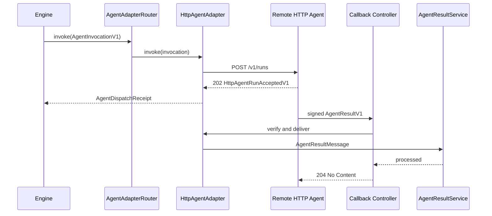

# HTTP Agent Adapter v1

## Purpose

`HttpAgentAdapter` lets the Orchestrator submit work to remote agents that
cannot consume Kafka. It uses the same asynchronous `AgentAdapter` and
`AgentResultService` boundaries as Kafka, so transport selection does not
change pipeline state, retries, timeouts, or DAG progression.

Kafka remains the default for every agent without an exact HTTP mapping.
HTTP is appropriate only when an operator controls the remote endpoint and
callback credentials.

## Protocol

The adapter sends `POST` to the configured `submitUrl` with:

```http
Content-Type: application/json
Accept: application/json
Authorization: Bearer <configured token>
Idempotency-Key: <invocationId>
User-Agent: Tenvyr-Orchestrator/0.1.0
```

`Authorization` is omitted when authentication is explicitly `none`. The
closed `HttpAgentRunRequestV1` body contains the canonical
`AgentInvocationV1` and callback delivery information. It never contains the
bearer token or callback secret.

The remote agent must return HTTP `202 Accepted`, `application/json`, and a
valid `HttpAgentRunAcceptedV1`. The response `invocationId` must match the
submission. `runId` becomes the transport-neutral receipt `dispatchId`.
HTTP `200` with a final result is not supported.

The callback route is:

```http
POST /internal/agent-callbacks/http/:agent
```

Its body is exactly one JSON serialization of `AgentResultV1`. A processed or
duplicate delivery returns `204`. Authentication failures return `401`;
invalid JSON/contracts return `400`; unavailable handling returns `503`; and a
result-handler failure returns `500`.

## Authentication

Outbound bearer tokens are resolved from operator-named environment variables.
Inbound callbacks require:

The four header names below are stable legacy protocol-v1 wire identifiers.
Tenvyr does not send or accept `X-Tenvyr-*` aliases. Any new prefix requires an
explicit future protocol and compatibility design.

```http
X-AgentWeave-Key-Id: <configured key ID>
X-AgentWeave-Timestamp: <Unix seconds>
X-AgentWeave-Delivery-Id: <unique delivery ID>
X-AgentWeave-Signature: v1=<lowercase SHA-256 hex digest>
```

The signed bytes are exactly:

```text
<timestamp>.<deliveryId>.<raw UTF-8 request body>
```

The digest is `HMAC-SHA256(callbackSecret, signedBytes)`. Verification uses the
route agent plus key ID to resolve the secret, rejects timestamps outside the
configured clock-skew window, and compares signatures in constant time.
Nest's `rawBody: true` support preserves the received bytes without disabling
normal JSON parsing.

The current configuration supports one active callback key per HTTP agent.
The explicit key ID allows a future separately reviewed multi-key rotation
period without changing the wire format.

## Idempotency

Outbound `Idempotency-Key` is the deterministic invocation ID
`<stepExecutionId>:<attempt>`. The remote agent owns deduplication of repeated
submissions with that key; the adapter adds no retry loop.

Callbacks are deduplicated by `agent + keyId + deliveryId` in a bounded
in-memory TTL cache. In-flight duplicates and completed duplicates return
`204` without calling the result handler twice. Handler failure removes the
reservation so the remote agent can retry. `AgentResultService` and
`EngineService` remain the semantic duplicate/stale-result guards.

The replay cache is not durable. Restarting the Orchestrator forgets delivery
IDs.

## Configuration

`AGENT_TRANSPORT_CONFIG` is a JSON object keyed by exact agent name:

```json
{
  "code-reviewer": {
    "kind": "kafka"
  },
  "observability": {
    "kind": "kafka"
  },
  "remote-security-reviewer": {
    "kind": "http",
    "submitUrl": "https://security-agent.internal/v1/runs",
    "outboundAuthentication": {
      "type": "bearer",
      "tokenEnv": "SECURITY_AGENT_TOKEN"
    },
    "callbackAuthentication": {
      "keyId": "security-agent-v1",
      "secretEnv": "SECURITY_AGENT_CALLBACK_SECRET"
    },
    "requestTimeoutMs": 10000,
    "maxResponseBytes": 65536
  }
}
```

Additional settings:

| Environment variable                   |                     Default | Purpose                                     |
| -------------------------------------- | --------------------------: | ------------------------------------------- |
| `HTTP_AGENT_CALLBACK_BASE_URL`         | required with an HTTP agent | Trusted public Orchestrator base URL        |
| `HTTP_AGENT_ALLOW_INSECURE`            |                     `false` | Explicitly permits `http:` development URLs |
| `HTTP_AGENT_CALLBACK_MAX_SKEW_SECONDS` |                       `300` | Past/future callback timestamp tolerance    |
| `HTTP_AGENT_REPLAY_TTL_MS`             |                 skew window | Replay-entry lifetime                       |
| `HTTP_AGENT_REPLAY_MAX_ENTRIES`        |                     `10000` | Replay-cache bound                          |

Startup rejects malformed JSON, unsupported fields/protocols, URL credentials,
insecure URLs without the explicit override, missing secret environment
values, invalid numeric limits, and replay TTL shorter than clock skew. Error
messages name fields but never secret values.

Agents absent from the map default to Kafka. Pipeline input cannot set URLs,
tokens, secrets, or transport kind.

## Lifecycle

`AgentAdapterLifecycle` starts one `AgentAdapterRouter`. The router registers
the same result handler with `KafkaAgentAdapter` and `HttpAgentAdapter`, and it
cleans up Kafka if HTTP startup fails. On shutdown it best-effort stops both.

`HttpAgentAdapter.start()` installs the handler and replay cleanup timer.
`stop()` clears the handler/cache/timer and aborts tracked outbound requests.
Neither concrete adapter nor the router owns independent Nest lifecycle hooks.

## Error behavior

Connection failures, timeouts, HTTP `408`, HTTP `429`, and HTTP `5xx` are
retryable. HTTP `400`, `401`, `403`, `404`, malformed acceptance bodies,
invocation mismatch, oversized responses, and invalid local configuration are
non-retryable. The adapter performs no automatic retry or Kafka fallback.

Contract failures remain `ContractValidationError`. Transport, protocol,
lifecycle, and callback failures use safe `AgentAdapterError` codes while
retaining the internal cause for diagnostics.

## Security boundaries

- Submit and callback base URLs come only from trusted startup configuration.
- URL credentials are forbidden; HTTPS is required unless the explicit
  development override is enabled.
- Callback URLs never use the inbound `Host` header, pipeline input, or a
  remote response.
- Logs contain identifiers, hosts, status, timing, and bounded metadata—not
  tokens, callback secrets, signatures, prompts, complete input, or raw bodies.
- HMAC is verified over raw bytes before JSON parsing or handler-readiness
  disclosure.

## Data flow



## Known limitations

- No result polling, status lookup, cancellation, or event streaming.
- No persistent callback inbox or durable replay cache.
- Remote agents own submission idempotency and callback retry policy.
- No automatic fallback, health routing, discovery, or load balancing.
- External production agents and network infrastructure are outside the local
  loopback integration test.

## TypeScript reference worker

`@tenvyr/worker` implements the remote side of this protocol without
creating an Orchestrator production dependency. The Orchestrator loopback spec
uses it only as a development dependency to verify `500 -> retry -> 204`,
stable delivery IDs, fresh signatures, duplicate submission deduplication, and
clean shutdown.

See [TypeScript Worker SDK](../workers/typescript-worker-sdk.md) and
[Python Worker SDK](../workers/python-worker-sdk.md) for runtime behavior, and
[`contracts/conformance`](../../../contracts/conformance) for language-neutral
wire fixtures.
