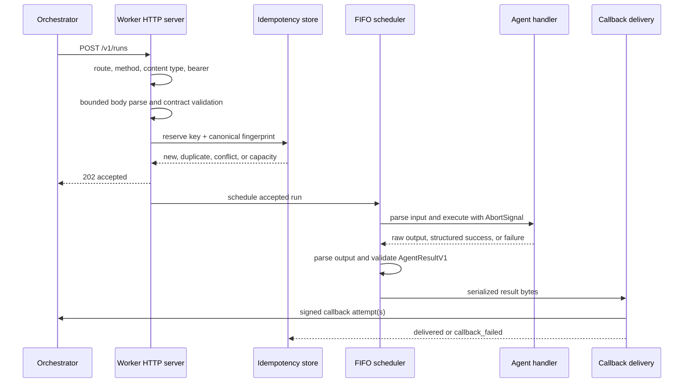

# TypeScript Worker SDK

## Purpose

`@agentweave/worker` is the reference Node.js implementation of the
language-neutral AgentWeave HTTP worker protocol. It receives canonical
invocations asynchronously, executes one registered agent with bounded local
resources, constructs a canonical result, and returns it through the existing
Orchestrator HMAC callback.

The package uses Node.js HTTP primitives and imports only the public API of
`@agentweave/contracts`. It does not depend on the Orchestrator, Kafka, NestJS,
database models, specialized agents, or the Java runner.

## Developer API

The root package exports:

```text
createAgentWeaveWorker
defineAgent
AgentExecutionError
AgentWeaveWorker
AgentWeaveWorkerConfig
AgentDefinition
AgentExecutionContext
AgentFailureOptions
AgentExecutionSuccess
WorkerLogger
WorkerAddress
WorkerLifecycleState
```

`defineAgent` accepts function parsers and parser objects exposing
`parse(value)`. A handler's direct return is always raw output. Only the
non-forgeable value returned by `context.success()` carries structured success
metadata. `context.fail()` throws `AgentExecutionError` and creates an explicit
failure result.

## Submission lifecycle



Authentication occurs before body parsing. The body is limited to 1 MiB, and
only `application/json` is accepted. A newly reserved invocation receives
`202 Accepted` before its handler can start.

## Idempotency

The `Idempotency-Key` maps to a SHA-256 fingerprint of the key plus canonical
request JSON. Canonicalization recursively sorts object keys and preserves
array order.

- Same key and same fingerprint returns the original acceptance without
  executing the handler again.
- Same key and different fingerprint returns a conflict.
- Active records never expire or get evicted.
- Terminal records expire after the configured TTL.
- When no record can be admitted safely, the worker returns `429`.

The store is in memory. A restart loses the queue, records, and callback
outbox. There is no status or cancellation endpoint.

## Callback delivery

The terminal `AgentResultV1` is validated with `parseAgentResult`, serialized
once, and reused byte-for-byte across delivery attempts. Each request signs:

```text
<timestamp>.<deliveryId>.<rawBody>
```

with HMAC-SHA256 and sends:

```text
X-AgentWeave-Key-Id
X-AgentWeave-Timestamp
X-AgentWeave-Delivery-Id
X-AgentWeave-Signature: v1=<lowercase hex digest>
```

The delivery ID stays stable across retries. Every attempt uses a fresh,
monotonically increasing timestamp and signature. Network errors, request
timeouts, `408`, `429`, and `5xx` retry with bounded exponential backoff and
jitter. A bounded delta-seconds `Retry-After` is honored. Redirects are not
followed; every `2xx` response is delivered.

Response bodies are drained up to 64 KiB. Exhaustion marks the invocation
`callback_failed` and invokes the optional `onCallbackDeliveryFailed` hook with
safe scalar metadata. Hook errors are isolated and never rerun the handler.

## Security

- Bearer scheme matching is case-insensitive; equal-length tokens use
  `timingSafeEqual`.
- Every `401` includes `WWW-Authenticate: Bearer`.
- Callback origins use exact normalized origin equality; suffix matching is
  forbidden.
- HTTPS is required unless insecure HTTP is explicitly enabled.
- Callback URL credentials, query strings, and fragments are forbidden.
- Request errors, logs, and failure-hook metadata exclude tokens, secrets,
  signatures, raw bodies, handler input/output, unexpected messages, and
  stacks.
- JSON validation rejects `BigInt`, `Date`, functions, symbols, cycles, and
  nested `undefined`.

## Execution behavior

The scheduler runs at most the configured concurrency and queues at most the
configured number of additional invocations in FIFO order. Input parsing runs
before the handler; output parsing runs on either direct output or the output
inside a structured success.

Execution selects exactly one terminal outcome:

- succeeded
- explicit agent failure
- sanitized unexpected failure
- deadline timeout
- worker shutdown cancellation

Timeout and shutdown are cooperative through `AbortSignal`. Late promise
completion is observed but cannot replace the selected result. The SDK does
not invent usage, upload artifacts, or log handler input/output.

## Lifecycle

The lifecycle is one-shot:

- `created -> starting -> running -> stopping -> stopped`
- repeated `start()` while running returns the same address
- `stopped` is terminal
- repeated `stop()` is a no-op

Shutdown first removes readiness and closes the listener. Queued invocations
become `WORKER_SHUTDOWN` results. Active executions and callback attempts drain
until the grace deadline; remaining work and timers are then aborted and
cleared. The SDK never installs process signal handlers.

## Limitations

- State is process-local and non-durable.
- There is no polling, status, cancellation, event streaming, discovery, load
  balancing, artifact upload, or persistent callback outbox.
- Cooperative cancellation cannot forcibly stop synchronous handler code.
- Insecure HTTP is for explicit local development only.
- The SDK does not change Orchestrator retry semantics, Kafka behavior,
  database schema, pipeline behavior, agent names, invocation IDs, Java
  execution, or the frontend.

Wire examples, deterministic HMAC vectors, and retry/status matrices are in
[`contracts/conformance`](../../contracts/conformance).
