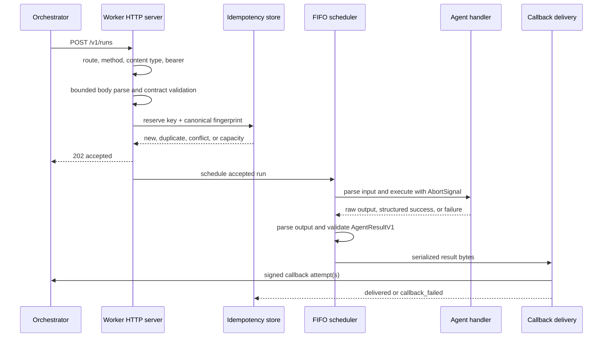

# TypeScript Worker SDK

## Purpose

`@tenvyr/worker` is the reference Node.js implementation of the
language-neutral Tenvyr HTTP worker protocol. It receives canonical
invocations asynchronously, executes one registered agent with bounded local
resources, constructs a canonical result, and returns it through the existing
Orchestrator HMAC callback.

The package uses Node.js HTTP primitives and imports only the public API of
`@tenvyr/contracts`. It does not depend on the Orchestrator, Kafka, NestJS,
database models, specialized agents, or the Java runner.

## Developer API

The root package exports:

```text
createTenvyrWorker
defineAgent
AgentExecutionError
TenvyrWorker
TenvyrWorkerConfig
AgentDefinition
AgentExecutionContext
AgentFailureOptions
AgentExecutionSuccess
WorkerLogger
WorkerAddress
WorkerLifecycleState
```

`defineAgent` accepts function parsers and parser objects exposing
`parse(value)`. A handler's direct return is always raw output. Only the
non-forgeable value returned by `context.success()` carries structured success
metadata. `context.fail()` throws `AgentExecutionError` and creates an explicit
failure result.

## Submission lifecycle



Authentication occurs before body parsing. The body is limited to 1 MiB, and
only `application/json` is accepted. A newly reserved invocation receives
`202 Accepted` before its handler can start.

## Idempotency

The `Idempotency-Key` maps to a SHA-256 fingerprint of the key plus canonical
request JSON. Canonicalization recursively sorts object keys and preserves
array order. It preserves `__proto__`, `constructor`, and `prototype` at every
nesting level and accepts ordinary and null-prototype JSON dictionaries without
mutating them.

- Same key and same fingerprint returns the original acceptance without
  executing the handler again.
- Same key and different fingerprint returns a conflict.
- Active records never expire or get evicted.
- Terminal records expire after the configured TTL.
- When no record can be admitted safely, the worker returns `429`.

The store is in memory. A restart loses the queue, records, and callback
outbox. There is no status or cancellation endpoint.

Canonical request fingerprinting is SDK-local idempotency behavior, not a
Tenvyr wire-protocol requirement. The implemented Python SDK preserves the
observable behavior—semantic duplicates do not rerun and conflicts return
`409`—but does not need to produce identical hash bytes. Neither implementation
claims RFC 8785/JCS conformance.

Unsafe integral numbers are rejected before fingerprinting and reservation.
All protocol integers, including integral-valued numbers, must remain within
the JavaScript safe-integer range. Finite non-integers remain valid. See
[JSON interoperability](../contracts/json-interoperability.md).

## Callback delivery

The terminal `AgentResultV1` is validated with `parseAgentResult`, serialized
once, and reused byte-for-byte across delivery attempts. Each request signs:

```text
<timestamp>.<deliveryId>.<rawBody>
```

with HMAC-SHA256 and sends:

The four header names below are stable legacy protocol-v1 wire identifiers.
Tenvyr does not send or accept `X-Tenvyr-*` aliases. Any new prefix requires an
explicit future protocol and compatibility design.

```text
X-AgentWeave-Key-Id
X-AgentWeave-Timestamp
X-AgentWeave-Delivery-Id
X-AgentWeave-Signature: v1=<lowercase hex digest>
```

The delivery ID and serialized body stay stable across retries. Every attempt
uses current Unix seconds; retries in the same second may therefore use the
same timestamp and signature. Replay protection is based on delivery ID.
Network errors, request timeouts, `408`, `429`, and `5xx` retry with bounded
exponential backoff and jitter. `Retry-After` accepts only ASCII
delta-seconds. Giant values are capped through bounded string comparison,
without converting an unbounded integer. Invalid values and HTTP dates fall
back to the calculated delay. Redirects are not followed; every `2xx`
response is delivered.

Response bodies are read with a streaming 64 KiB bound and cancelled as soon
as the limit is exceeded. Exhaustion is a non-retryable protocol failure,
marks the invocation `callback_failed`, and invokes the optional
`onCallbackDeliveryFailed` hook with safe scalar metadata. Hook errors are
isolated and never rerun the handler.

## Security

- Bearer scheme matching is case-insensitive; equal-length tokens use
  `timingSafeEqual`.
- Every `401` includes `WWW-Authenticate: Bearer`.
- Callback origins use exact normalized origin equality; suffix matching is
  forbidden.
- HTTPS is required unless insecure HTTP is explicitly enabled.
- Callback URL credentials, query strings, and fragments are forbidden.
- Request errors, logs, and failure-hook metadata exclude tokens, secrets,
  signatures, raw bodies, handler input/output, unexpected messages, and
  stacks.
- JSON validation rejects `BigInt`, `Date`, functions, symbols, cycles, and
  nested `undefined`.

## Execution behavior

The scheduler runs at most the configured concurrency and queues at most the
configured number of additional invocations in FIFO order. Input parsing runs
before the handler; output parsing runs on either direct output or the output
inside a structured success.

Execution selects exactly one terminal outcome:

- succeeded
- explicit agent failure
- sanitized unexpected failure
- deadline timeout
- worker shutdown cancellation

Timeout and shutdown are cooperative through `AbortSignal`. Late promise
completion is observed but cannot replace the selected result. The SDK does
not invent usage, upload artifacts, or log handler input/output.

A handler that ignores `AbortSignal` cannot be forcibly stopped by JavaScript.
The Worker stops awaiting it, fixes the terminal outcome, observes its eventual
settlement, and never creates a second callback from the late completion.

## Lifecycle

The lifecycle is one-shot:

- `created -> starting -> running -> stopping -> stopped`
- repeated `start()` while running returns the same address
- `stopped` is terminal
- repeated `stop()` is a no-op

Shutdown first removes readiness and closes the listener. Queued invocations
are already accepted responsibility, so they are removed from the queue and
produce one `WORKER_SHUTDOWN` cancellation callback during the grace period.
Active executions and callback attempts may finish during grace.

At the grace deadline the Worker aborts a worker-wide shutdown signal before
aborting per-execution and per-callback controllers. This signal also governs
callbacks created by timeout/shutdown result mapping after force shutdown has
started. Retry sleeps and callback response streams are cancelled. A callback
that cannot start after force shutdown is recorded with a safe structured log.
The Worker waits for scheduler and callback work to settle; it never clears a
live promise from tracking.

After `stop()` resolves there is no active execution owned by the Worker,
callback request, callback retry sleep, Worker timer, or listening socket.
Repeated `stop()` shares the in-progress stop and remains idempotent after the
terminal `stopped` state. The SDK never installs process signal handlers.

## Package boundary

Both `@tenvyr/contracts` and `@tenvyr/worker` are version `0.1.0` and remain
`private: true` pending owner-controlled registry, legal, and publication
gates. Both declare MIT and ship the license text. Their CommonJS manifests
expose only `"."`, ship only `dist`, `README.md`, license, and package metadata,
require Node.js 22+, and do not expose
internal stores, schedulers, callback machinery, or HTTP helpers.

Run `pnpm verify:package-packs` to build, pack, inspect both tarballs, rewrite
the Worker `workspace:*` dependency to the matching contracts version, install
both tarballs outside the monorepo, compile a root-API consumer, reject an
internal deep import, start the packed Worker, call `/health/live`, and stop it.
The language-neutral conformance fixtures remain repository development
content; only the JSON Schemas copied under the contracts `dist` directory are
runtime package content.

## Limitations

- State is process-local and non-durable.
- There is no polling, status, cancellation, event streaming, discovery, load
  balancing, artifact upload, or persistent callback outbox.
- Cooperative cancellation cannot forcibly stop synchronous handler code.
- Insecure HTTP is for explicit local development only.
- The SDK does not change Orchestrator retry semantics, Kafka behavior,
  database schema, pipeline behavior, agent names, invocation IDs, Java
  execution, or the frontend.
- The packages must not be published until the owner completes the registry,
  legal, identity-reservation, and publication gates.

Wire examples, deterministic HMAC vectors, and retry/status matrices are in
[`contracts/conformance`](../../../contracts/conformance).

Future observability, W3C propagation, provenance, privacy, cost, dashboard,
instrumentation, and naming direction is documented in the
[observability and provenance roadmap](../../roadmap/observability-provenance.md).
Those capabilities remain future roadmap work.
