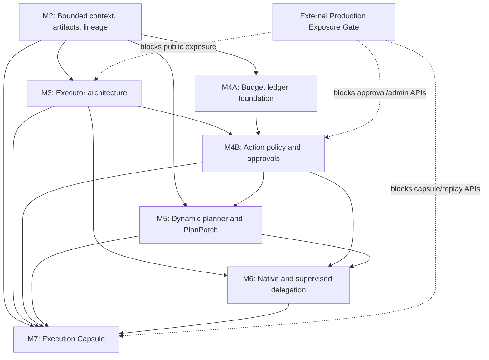

# Tenvyr technical roadmap

This is the durable technical index for the approved remaining product roadmap.
It is planning authority, not a claim that future capabilities exist.

## Baseline

M0 is closed: PostgreSQL owns execution truth; each run has an immutable initial
`ExecutionPlanRevision`; logical steps and attempts are separate; attempt claim
atomically creates a durable `DispatchOutbox`; canonical terminal delivery enters
`ResultInbox`; reconciliation, retry, deadlines, cancellation, duplicates, and
multi-replica races use persisted authority.

M1 is closed: `AgentEventV1` is bounded append-only operational evidence with
conflict retention and server-received liveness projection. Deterministic
supervision may synthesize canonical results, while `AgentResultV1` remains the
only worker-originated terminal authority.

M2 is independently closed. It delivers bounded versioned ExecutionState,
immutable per-attempt ContextSnapshots, explicit artifact projection and
exposure lineage, pipeline-declared controlled state writes, and durable
mutation provenance. The historical [M2 execution program](../../../archive/plans/m2-program/README.md)
and [independent closure review](../../../archive/reviews/2026-08-11-m2-independent-closure.md)
preserve the implementation evidence. M3–M7 are implemented and READY for independent SOL verification.

## Product destination

Tenvyr becomes a framework-neutral supervisory execution control plane:

> Run any agent. Bound what it can do. Know exactly what happened.

Native runtimes own prompts, reasoning, provider APIs, tools, and opaque internal
subagents. Tenvyr owns durable execution authority, bounded context, executor
lifecycle, policy, budgets, approvals, plan materialization, supervised delegation,
provenance, and replay-as-new-execution.

## Dependency graph



Technical sequencing preserves the product milestone order. M4 is split
internally: budget accounting can build after M2, but enforceable action policy
needs an M3 executor boundary that can intercept an action before side effects.
M7 capture facts are added by their owning milestones; M7 assembles read/export,
comparison, replay, and telemetry projections rather than retroactively inventing
provenance.

## Milestone index and status

| Milestone               | Status | Entry point                                                                                             | Hard dependency               |
| ----------------------- | ------ | ------------------------------------------------------------------------------------------------------- | ----------------------------- |
| M0 durable execution    | CLOSED | [Current control plane](../../../architecture/control-plane.md)                                         | —                             |
| M1 events/supervision   | CLOSED | [Current control plane](../../../architecture/control-plane.md#agentevents-and-supervision)             | M0                            |
| M2 context/artifacts    | CLOSED | [Historical M2 pack](../../../archive/plans/m2-program/README.md)                                       | M0, M1                        |
| M3 executors/runtimes   | READY  | [M3 plan](M3-executors-providers/PLAN.md) — [report](M3-executors-providers/IMPLEMENTATION_REPORT.md)   | independently closed M2       |
| M4 policy/budgets       | READY  | [M4 plan](M4-policy-budgets/PLAN.md) — [report](M4-policy-budgets/IMPLEMENTATION_REPORT.md)             | M2; action policy also M3     |
| M5 dynamic planner      | READY  | [M5 plan](M5-dynamic-planner/PLAN.md) — [report](M5-dynamic-planner/IMPLEMENTATION_REPORT.md)           | M2, M4 enforcement foundation |
| M6 delegation/subagents | READY  | [M6 plan](M6-delegation-subagents/PLAN.md) — [report](M6-delegation-subagents/IMPLEMENTATION_REPORT.md) | M3, M4, M5                    |
| M7 capsule/replay       | READY  | [M7 plan](M7-execution-capsule/PLAN.md) — [report](M7-execution-capsule/IMPLEMENTATION_REPORT.md)       | M2–M6 evidence                |

All five remaining milestones (M3–M7) are implemented end-to-end with
provisional implementation reports; each is READY for the independent SOL
verification pass (per-milestone receipts and the full verification
battery are recorded in EXECUTION_STATUS.md).

Runtime progress is recorded in [EXECUTION_STATUS.md](EXECUTION_STATUS.md). DeepSeek
may move a blocked milestone to READY only when its recorded dependencies are
independently closed or the Tech Lead explicitly authorizes a bounded prerequisite.

## Required reading

- [Long-running DeepSeek operating prompt](DEEPSEEK_LONG_RUN.md)
- [External Production Exposure Gate](EXTERNAL_PRODUCTION_EXPOSURE_GATE.md)
- [Current-technical-research register](RESEARCH_REGISTER.md)
- [Implementation report template](IMPLEMENTATION_REPORT_TEMPLATE.md)
- M3: [PLAN](M3-executors-providers/PLAN.md), [SPEC](M3-executors-providers/SPEC.md),
  [VERIFY](M3-executors-providers/VERIFY.md), [GOAL](M3-executors-providers/GOAL.md)
- M4: [PLAN](M4-policy-budgets/PLAN.md), [SPEC](M4-policy-budgets/SPEC.md),
  [VERIFY](M4-policy-budgets/VERIFY.md), [GOAL](M4-policy-budgets/GOAL.md)
- M5: [PLAN](M5-dynamic-planner/PLAN.md), [SPEC](M5-dynamic-planner/SPEC.md),
  [VERIFY](M5-dynamic-planner/VERIFY.md), [GOAL](M5-dynamic-planner/GOAL.md)
- M6: [PLAN](M6-delegation-subagents/PLAN.md), [SPEC](M6-delegation-subagents/SPEC.md),
  [VERIFY](M6-delegation-subagents/VERIFY.md), [GOAL](M6-delegation-subagents/GOAL.md)
- M7: [PLAN](M7-execution-capsule/PLAN.md), [SPEC](M7-execution-capsule/SPEC.md),
  [VERIFY](M7-execution-capsule/VERIFY.md), [GOAL](M7-execution-capsule/GOAL.md)

## Cross-cutting dependencies

1. External exposure: general Gateway/Orchestrator APIs remain unauthenticated.
   Internal/local implementation may proceed, but no secure external deployment,
   approval administration, sensitive export, or replay control claim may pass the
   [exposure gate](EXTERNAL_PRODUCTION_EXPOSURE_GATE.md).
2. Protocol/SDK parity: canonical protocol changes require TypeScript, Python,
   HTTP, Kafka, schema identity, conformance, and package verification together.
3. Migrations: PostgreSQL migrations are ordered authority; no milestone may use
   ORM synchronization as production evidence or fabricate historical facts.
4. Artifact bytes: M2 establishes reference authority. Byte storage, encryption,
   retention, scanning, and signed access require a separate approved storage and
   external-exposure decision; later milestones must not assume them.
5. Current external standards: Codex, Claude Agent SDK, A2A, MCP, provider APIs,
   and OpenTelemetry require official-source research at implementation time.

## Technical decision log

| ID    | Decision                                                                                                                                         | Reason                                                                              |
| ----- | ------------------------------------------------------------------------------------------------------------------------------------------------ | ----------------------------------------------------------------------------------- |
| R-001 | Keep `AgentAdapter` as the existing transport boundary; M3 evaluates a higher executor lifecycle/authority boundary without a cosmetic rename.   | Transport and runtime ownership differ, and current Kafka/HTTP behavior is proven.  |
| R-002 | Executor and provider are separate. Provider credentials/config remain inside trusted runtime configuration or secret references.                | Prevent Orchestrator prompt/provider coupling and reusable-pipeline secrets.        |
| R-003 | M4 budgets use reservation plus append-only reconciliation, not telemetry columns.                                                               | Concurrent branches need pre-action enforcement and auditable release/actual usage. |
| R-004 | Policy applies only at observable, interceptable authority boundaries. Opaque runtime-internal tool calls cannot be falsely claimed as enforced. | A policy record after a side effect is decorative, not supervision.                 |
| R-005 | Planner emits restricted `PlanPatch` proposals against `baseRevision`; Tenvyr validates and creates a new immutable revision.                    | Preserve frozen work, auditability, and optimistic concurrency.                     |
| R-006 | Delegation modes remain opaque, observed, and supervised. Supervised delegation prefers child Execution reuse after repository-fit verification. | Native reasoning remains native while Tenvyr can enforce selected boundaries.       |
| R-007 | Execution Capsule is a reconstructable read/export model over authoritative facts, not one giant mutable table.                                  | Avoid duplicated truth and permit cache/materialization later if measured.          |
| R-008 | Replay always creates a new execution linked to immutable source evidence.                                                                       | Original execution is never rewound; LLM output determinism is not claimed.         |
| R-009 | OTLP/W3C/PROV-style outputs are projections. PostgreSQL execution records remain authority.                                                      | Telemetry may be sampled, delayed, or rebuilt without changing outcomes.            |

## Sol verification workflow

After each provisional DeepSeek milestone report, Sol independently performs:

```text
git status and diff
→ inspect production code, migrations, tests, docs, and report
→ run available focused and full verification
→ adversarial concurrency/crash/security audit
→ PASS or CLOSURE_REQUIRED
```

`CLOSURE_REQUIRED` produces one bounded closure goal for the defect. It does not
regenerate this roadmap or authorize the next milestone with a known blocker.

## Roadmap closure

The roadmap is complete only after M2–M7 are independently closed and the
external exposure gate is either closed for the claimed deployment mode or remains
an explicit product limitation. Public release, cloud deployment, and registry
publication remain separately authorized owner actions.
