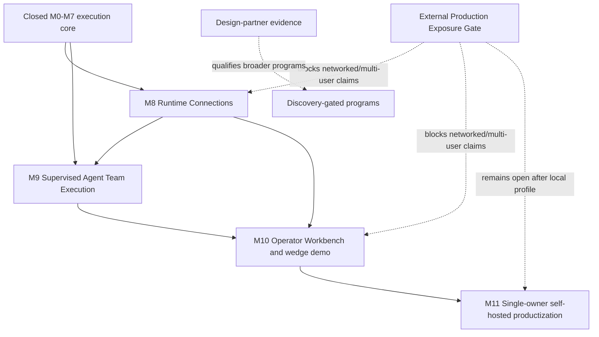

# Tenvyr productization roadmap

This is the accepted planning authority after the independently closed M0–M7
program. It does not claim that M8–M11 exist. Current contracts, code, tests,
architecture, and the implementation ledger remain runtime truth.

## Current baseline

M0–M7 provide PostgreSQL-authoritative execution; immutable plan revisions;
LogicalSteps and immutable StepAttempts; at-least-once outbox dispatch and a
durable ResultInbox; durable AgentEvents and deterministic watchdogs; bounded
ExecutionState and ContextSnapshots; Artifact References and lineage;
framework-neutral frozen executor identity; a trusted-code-only local process
host; policy decisions, approvals, WAITING, hierarchical budgets, bounded
PlanPatch planning, three delegation modes, child authority inheritance,
Execution Capsules, controlled replay, structural comparison/provenance, and a
bounded telemetry projection.

M0–M7 are CLOSED. Their explicit non-claims remain: local execution is not a
sandbox; observed delegation is evidence, not authority; external ArtifactRefs
do not prove byte ownership or consumption; replay is a new execution rather
than deterministic model reproduction; historical approvals, credentials, and
permissions are not replay authority; and telemetry is projection, not truth.

## Product problem and target experience

Tenvyr has a strong execution core but no coherent adoption path for connecting
real runtimes and running a bounded agent team. The leading product wedge is:

> Give Tenvyr a goal, choose a team of real agent runtimes, let them work under
> bounded authority, watch Tenvyr verify and iterate, and receive a replayable
> execution record.

```text
Goal -> Planner -> bounded worker batch -> fan-in -> Verifier
             ^                                 |
             `-- Tenvyr-authorized CONTINUE ---'
```

Agent runtimes decide what work to propose and how to evaluate it. Tenvyr's
deterministic Coordinator decides whether another iteration is allowed.

## Ordering decision and dependency graph

Runtime Connections comes first, but deliberately stays thin. M9 can be tested
with deterministic generic Workers, yet the product wedge has weak adoption
value until Codex, Claude, and OpenCode can be selected through truthful,
health-checked connection profiles. M8 therefore establishes frozen connection
identity and three local integration paths without building a provider proxy.



## Milestones

| Milestone                                   | Outcome                                                                                                                                 | Product value                                                                | Dependency                       | Status                |
| ------------------------------------------- | --------------------------------------------------------------------------------------------------------------------------------------- | ---------------------------------------------------------------------------- | -------------------------------- | --------------------- |
| M8 Runtime Connections                      | Operators configure, detect, health-check, revoke, and freeze Codex, Claude, OpenCode, Generic CLI, HTTP, and Kafka runtime connections | Real runtimes become selectable without turning Tenvyr into a model router   | M3 executor foundation           | READY                 |
| M9 Supervised Agent Team Execution          | A deterministic Coordinator runs bounded Planner/Worker/Verifier iterations with exact recovery and one-winner continuation             | Delivers the differentiated autonomous-team control loop                     | M4–M6 and M8 connection identity | BLOCKED on M8 closure |
| M10 Operator Workbench                      | Local operator can connect runtimes, launch a team goal, observe authority, act on approvals, and inspect its Capsule                   | Turns infrastructure into the primary adoption wedge and demo                | M8–M9                            | BLOCKED               |
| M11 Single-owner self-hosted productization | Supported Docker installation, upgrade, backup, secret bootstrap, health, and local security profile                                    | Makes design-partner adoption repeatable without premature SaaS architecture | M10 and design-partner feedback  | BLOCKED               |

Each milestone has a [PLAN](M8-runtime-connections/PLAN.md), behavioral
[SPEC](M8-runtime-connections/SPEC.md), independent [VERIFY](M8-runtime-connections/VERIFY.md),
and adaptive [GOAL](M8-runtime-connections/GOAL.md). The same four-file contract
exists under M9, M10, and M11.

## Product and commercial prioritization

M8–M10 rank highest on customer pain, adoption leverage, differentiation, and
time-to-value. M11 has high adoption leverage but follows evidence from the
integrated wedge. Artifact bytes, broad interoperability, sandbox adapters,
wired OTLP, Kubernetes, multi-tenant SaaS, and enterprise RBAC carry higher
security or maintenance cost than current evidence supports; their promotion
criteria live in [PRODUCT_DISCOVERY.md](PRODUCT_DISCOVERY.md).

ICP B—autonomous/coding-agent teams—is the initial wedge because the full
Planner/Workers/Verifier experience can be demonstrated quickly with real
runtimes. ICP A—internal AI platform teams—remains the expansion hypothesis;
M8's framework-neutral connection model and M9's generic Worker path preserve
that option without building enterprise surfaces early.

Scores are directional planning judgments (`1` low, `5` high); for engineering,
security, and maintenance, a higher number means more risk/burden.

| Milestone                      | Pain | Adoption | Differentiation | Time-to-value | Dependency leverage | Engineering risk | Security risk | Maintenance | Commercial leverage |
| ------------------------------ | ---: | -------: | --------------: | ------------: | ------------------: | ---------------: | ------------: | ----------: | ------------------: |
| M8 Runtime Connections         |    4 |        5 |               3 |             5 |                   5 |                3 |             4 |           4 |                   4 |
| M9 Agent Team Execution        |    5 |        5 |               5 |             4 |                   5 |                5 |             4 |           4 |                   5 |
| M10 Operator Workbench         |    5 |        5 |               4 |             5 |                   5 |                3 |             4 |           3 |                   5 |
| M11 Self-hosted productization |    4 |        4 |               2 |             3 |                   3 |                4 |             4 |           4 |                   4 |

## Cross-cutting gates

1. [External Production Exposure Gate](EXTERNAL_PRODUCTION_EXPOSURE_GATE.md):
   remains OPEN; M8–M11 may claim only an operator-controlled local/self-hosted
   profile unless the deployment and ownership model is separately approved.
2. Public package/release gate: npm/PyPI publication, external repository naming,
   registry reservation, and legal approval remain owner-controlled and blocked.
3. Security: credentials are references or runtime-owned state; local authenticated
   CLIs are trusted local integrations; no consumer-session harvesting, secret
   echoing, provider proxy, or sandbox claim.
4. Discovery: M10 must record design-partner evidence before a discovery-gated
   program becomes READY. Technical ease is not evidence of product value.
5. Documentation identity: M8 includes a bounded truth-refresh slice for README,
   feature matrix, terminology, getting started, demo, and explicit limitations;
   legacy protocol/deployment identifiers remain only where compatibility requires.

## Technical decision log

| ID    | Decision                                                                                                                                                                                                                                                                       | Reason                                                                                                       |
| ----- | ------------------------------------------------------------------------------------------------------------------------------------------------------------------------------------------------------------------------------------------------------------------------------ | ------------------------------------------------------------------------------------------------------------ |
| P-001 | Coordinator is a deterministic Tenvyr state machine; Planner and Verifier are supervised agent roles returning untrusted proposals.                                                                                                                                            | Authority cannot depend on recursive model self-authorization.                                               |
| P-002 | M9 composes immutable plan revisions, LogicalSteps, attempts, DAG dependencies, ContextSnapshots, ArtifactRefs, PlanPatch, policy, approvals, and budgets. It adds no `AgentTeamRun` or `TaskBatch` table merely for naming.                                                   | Existing authority primitives already cover worker execution and evidence.                                   |
| P-003 | Add only a minimal PostgreSQL coordination state machine and immutable iteration/decision identity required for phase recovery, iteration uniqueness, one-winner continuation, and pre-terminal fan-in. ExecutionState remains bounded agent-facing state, not loop authority. | Current primitives cannot serialize CONTINUE before normal completion or preserve exact loop recovery alone. |
| P-004 | Runtime Connection is operator configuration that resolves to a frozen secret-free executor/runtime descriptor. Runtime and provider remain distinct.                                                                                                                          | Attempts must not change identity when configuration rotates.                                                |
| P-005 | Local authenticated Codex/Claude/OpenCode installations are trusted local modes. Machine/team modes use documented credential references or runtime-owned auth.                                                                                                                | Avoid unsupported session scraping and credential proxying.                                                  |
| P-006 | M8 precedes M9, but M9 remains verifiable with deterministic mock/Worker runtimes.                                                                                                                                                                                             | The product wedge gets real integrations without coupling loop correctness to vendor services.               |
| P-007 | The Operator Workbench projects authoritative control-plane state; it gets no parallel frontend workflow state machine and no generic no-code designer.                                                                                                                        | PostgreSQL remains truth and the UI stays focused on control.                                                |
| P-008 | Initial deployment target is single-owner local/self-hosted. Single-organization, private-cloud, and multi-tenant models require evidence and a new product decision.                                                                                                          | Prevent speculative tenancy/RBAC complexity.                                                                 |
| P-009 | MCP and A2A are open interoperability candidates, not replacements for Tenvyr persistence or authority.                                                                                                                                                                        | Keep external agents standards-based and core framework-neutral.                                             |

## Operating files

- [Execution status](EXECUTION_STATUS.md)
- [DeepSeek long-run entrypoint](DEEPSEEK_LONG_RUN.md)
- [Research register](RESEARCH_REGISTER.md)
- [Product discovery and design partners](PRODUCT_DISCOVERY.md)
- [Implementation report template](IMPLEMENTATION_REPORT_TEMPLATE.md)
- [M8 implementation report](M8-runtime-connections/IMPLEMENTATION_REPORT.md)
  (provisional; Sol audit requested)
- [M9 implementation report](M9-supervised-agent-team-execution/IMPLEMENTATION_REPORT.md)
  (provisional; Sol audit requested)
- [M10 implementation report](M10-operator-workbench/IMPLEMENTATION_REPORT.md)
  (provisional; Sol audit requested)
- [M11 implementation report](M11-self-hosted-productization/IMPLEMENTATION_REPORT.md)
  (provisional; Sol audit requested)

## Milestone contracts

- M8 Runtime Connections: [PLAN](M8-runtime-connections/PLAN.md),
  [SPEC](M8-runtime-connections/SPEC.md),
  [VERIFY](M8-runtime-connections/VERIFY.md), and
  [GOAL](M8-runtime-connections/GOAL.md).
- M9 Supervised Agent Team Execution:
  [PLAN](M9-supervised-agent-team-execution/PLAN.md),
  [SPEC](M9-supervised-agent-team-execution/SPEC.md),
  [VERIFY](M9-supervised-agent-team-execution/VERIFY.md), and
  [GOAL](M9-supervised-agent-team-execution/GOAL.md).
- M10 Operator Workbench: [PLAN](M10-operator-workbench/PLAN.md),
  [SPEC](M10-operator-workbench/SPEC.md),
  [VERIFY](M10-operator-workbench/VERIFY.md), and
  [GOAL](M10-operator-workbench/GOAL.md).
- M11 Single-owner self-hosted productization:
  [PLAN](M11-self-hosted-productization/PLAN.md),
  [SPEC](M11-self-hosted-productization/SPEC.md),
  [VERIFY](M11-self-hosted-productization/VERIFY.md), and
  [GOAL](M11-self-hosted-productization/GOAL.md).

## Roadmap closure

M8–M11 close only through independent Sol verification. Closure proves the
single-owner product wedge; it does not silently close the External Production
Exposure Gate, authorize package publication, or promote a discovery-gated
program.
