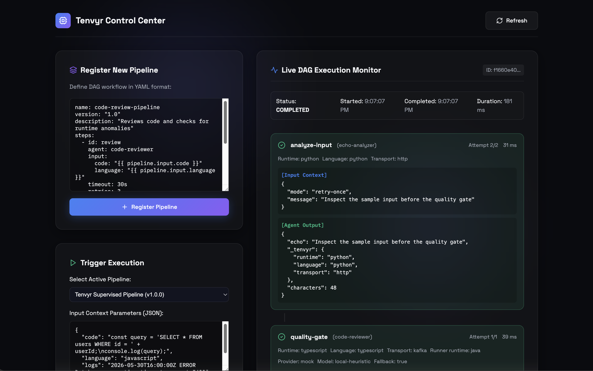

# Sổ tay người dùng Tenvyr

Sổ tay này là tài liệu hướng dẫn dành cho người vận hành và nhà phát triển về
cách cài đặt, chạy và sử dụng Tenvyr. Nó bổ sung cho
[chỉ mục tài liệu](README.md): sổ tay giải thích **cách làm**, các trang tham
chiếu giải thích **vì sao**. Nếu sổ tay này mâu thuẫn với hợp đồng thực thi
(executable contracts) hoặc mã nguồn, mã và bài kiểm tra được ưu tiên.

Bản tiếng Anh đầy đủ: [Tenvyr User Manual](user-manual.md).

## 1. Tenvyr là gì

Tenvyr là một control plane (lớp điều phối) thực thi agent — trung lập với
framework — dành cho các quy trình agent có giám sát. Tenvyr chạy các agent
nền Python, TypeScript và Java dưới dạng các bước (step) được lưu trạng thái
bền vững, với kết quả chuẩn hóa, cơ chế retry, timeout, idempotency, bảo mật
callback và một dashboard để kiểm tra những gì đã xảy ra.

Tenvyr sở hữu **khi nào** công việc chạy, **runtime và transport nào** thực
thi nó, và **cách** quy trình ghi nhận thành công hay thất bại. Ứng dụng agent
giữ quyền sở hữu prompt, công cụ, suy luận, framework và các lời gọi
model-provider.

Tenvyr **không phải** là model router, sân chơi prompt, kho chứa thông tin xác
thực (credential vault) hay sandbox. Thực thi cục bộ chỉ dành cho mã đáng tin
cậy (trusted-code-only), Runtime Connections lưu _tham chiếu_ thông tin xác
thực (không bao giờ lưu giá trị), và việc quản trị chỉ diễn ra cục bộ/tự lưu
trữ (self-hosted) phía sau External Production Exposure Gate.

## 2. Khái niệm cốt lõi

| Khái niệm           | Ý nghĩa                                                                                                                                                                                |
| ------------------- | -------------------------------------------------------------------------------------------------------------------------------------------------------------------------------------- |
| Pipeline            | Quy trình khai báo bằng YAML: các bước, phụ thuộc, điều kiện, timeout, retry.                                                                                                          |
| Execution           | Một lần chạy của pipeline, được lưu trạng thái đầy đủ.                                                                                                                                 |
| Step                | Một đơn vị công việc trong execution (ví dụ `analyze-input`).                                                                                                                          |
| Attempt             | Một lần thực thi của một step. Retry tạo attempt mới; dashboard hiển thị `attempt N/M`.                                                                                                |
| Runtime             | Thứ thực thi công việc: Python Worker, TypeScript Worker, agent nền Java, hoặc CLI runtime được cấu hình (Codex, Claude, OpenCode, Generic CLI).                                       |
| Transport           | Cách công việc được chuyển giao: HTTP adapter v1 (callback có chữ ký) hoặc Kafka runtime v1.                                                                                           |
| Worker              | Ứng dụng xây dựng bằng `@tenvyr/worker` (TypeScript) hoặc `tenvyr-worker` (Python): nhận invocation, làm việc, trả về kết quả chuẩn.                                                   |
| `AgentInvocationV1` | Yêu cầu công việc có phiên bản, chuẩn hóa, gửi tới agent.                                                                                                                              |
| `AgentResultV1`     | Kết quả có phiên bản, chuẩn hóa do agent trả về. `AgentResult` là **nguồn quyết định duy nhất** cho trạng thái kết thúc của một attempt.                                               |
| `AgentEventV1`      | Sự kiện vận hành tùy chọn (`accepted`, `progress`, `log`, `heartbeat`, `artifact`, `completed`, `failed`) — trở thành bằng chứng bền vững nhưng không bao giờ tự kết thúc một attempt. |
| Runtime Connection  | Kết nối tới CLI runtime do người vận hành cấu hình, kiểm tra (probe) và có thể đóng băng (M8).                                                                                         |
| Workbench           | Giao diện người vận hành cho các lượt chạy đội có giám sát: planner, verifier, worker, giới hạn ngân sách, phê duyệt.                                                                  |
| Capsule             | Tóm tắt execution cuối cùng (M7): bản xuất bất biến của những gì đã xảy ra.                                                                                                            |

Kiến trúc trong một dòng: **Dashboard → Gateway → Orchestrator → trạng thái
pipeline được lưu bền vững**, với hai đường thực thi — Kafka → agent chuyên
dụng → Java Runner, và HTTP → Python/TypeScript Worker → callback có chữ ký.
Xem [tổng quan hệ thống](architecture/overview.md) để biết bức tranh đầy đủ.

## 3. Yêu cầu hệ thống

- Node.js 22+ với Corepack và pnpm 9 (được chốt trong package metadata)
- Python 3.11+ (cho Python Worker SDK và ví dụ)
- JDK 17 và Maven (cho Java Agent Runner)
- Docker với Docker Compose v2 (override `no-host-ports` cần Compose 2.24+)

```bash
corepack enable
```

## 4. Cài đặt

```bash
pnpm install --frozen-lockfile
pnpm setup:check        # kiểm tra toolchain và môi trường
```

Tùy chọn, cho Python worker ví dụ:

```bash
python3 -m venv .venv
.venv/bin/pip install -e 'sdks/python-worker[dev]'
```

## 5. Khởi động nhanh: showcase ngoại tuyến

Showcase là lần chạy cục bộ đầy đủ ngắn nhất. Nó **ngoại tuyến và tất định
(deterministic)** — provider mock mặc định không cần API key.

```bash
pnpm showcase:up        # build và khởi động stack showcase
pnpm showcase:smoke     # tự khởi tạo dữ liệu demo, chạy success + retry-once, xác minh kết quả
```

Sau đó mở **http://localhost:4000/dashboard**.

`showcase:smoke` làm gì: tự động khởi tạo **Tenvyr Supervised Pipeline** (seed
idempotent — chỉ chạy `pnpm showcase:seed` riêng khi muốn tạo dữ liệu trước),
chạy một luồng Python-to-Java thành công, sau đó chạy `retry-once` và xác minh
bước Python hoàn tất ở lần thử thứ hai. Dashboard hiển thị trạng thái bước,
runtime, transport, số attempt, thời lượng, bản xem trước đầu vào/đầu ra an
toàn và metadata provider (nếu có).



Chỉ dừng các tài nguyên showcase:

```bash
pnpm showcase:down
```

**Lưu ý về provider:** `showcase:up` chỉ kích hoạt provider thật khi
`LLM_PROVIDER` được export tường minh trong shell gọi. Giá trị mà Compose chỉ
tự nạp từ `.env` không bao giờ đưa showcase vào lời gọi trực tiếp. Với provider
thật được export và `LLM_FAILURE_MODE` không đặt, lỗi provider sẽ dẫn đến
`fail` — key sai không bao giờ âm thầm trở thành kết quả thành công. Chỉ export
`LLM_FAILURE_MODE=mock` khi chủ động muốn fallback có nhãn. Xem
[sử dụng model providers](showcase/using-model-providers.md).

Để có kịch bản demo 5–10 phút, làm theo
[hướng dẫn demo](showcase/demo-guide.md).

## 6. Chạy stack phát triển đầy đủ

Lệnh một dòng cho stack phát triển: khởi động hạ tầng (Postgres, Redis,
Zookeeper, Kafka, Kafka UI) cùng các dịch vụ vận hành — orchestrator, gateway
và frontend — song song ở chế độ watch:

```bash
pnpm dev
```

Dừng toàn bộ bằng `Ctrl-C` — cả các dịch vụ watch **lẫn** Compose stack đều
được tắt (named volumes được giữ, dữ liệu dev không mất). Chỉ cần chạy
`pnpm dev:infra:down` sau khi bị kill cứng (SIGKILL), khi bước dọn dẹp tự động
không chạy được. Nếu trước đó bạn đã khởi động toàn bộ Compose stack
(`pnpm dev:infra`), hãy dừng nó trước (`pnpm dev:infra:down`) — các container
ứng dụng của nó đang giữ cổng host mà các dịch vụ watch cần.

`pnpm dev` bao phủ đường HTTP Worker (orchestrator + gateway + dashboard).
Các agent đường Kafka (`pnpm dev:reviewer`, `pnpm dev:observability`) không
được bao gồm vì client Kafka chạy trên host không kết nối được broker Compose
(nó quảng bá hostname nội bộ docker) — hãy chạy các agent đó bên trong toàn bộ
Compose stack. Để khởi động mọi thứ trong Docker, hoặc phát triển từng dịch vụ
trong các terminal riêng:

```bash
pnpm dev:infra           # khởi động mọi dịch vụ trong Compose file mặc định
pnpm dev:orchestrator    # :3001
pnpm dev:gateway         # :3000
pnpm dev:reviewer        # :3002
pnpm dev:observability   # :3003
pnpm dev:frontend        # :4000
```

Java Agent Runner ngoài Compose:

```bash
cd services/agent-runner
mvn spring-boot:run      # :8085
```

Nếu cổng host của Postgres, Redis hoặc Kafka đã bị chiếm, override đi kèm
trong repo sẽ bỏ các cổng host đó nhưng vẫn giữ kết nối giữa các container:

```bash
docker compose -f docker-compose.yml -f docker-compose.no-host-ports.yml up -d --build
```

Khi chỉ cổng Postgres bị project khác chiếm (ví dụ database dev thứ hai), hãy
giữ truy cập host: cổng Postgres của dev Compose được tham số hóa qua
`TENVYR_POSTGRES_PORT` (mặc định `5432`). `pnpm dev` tự đọc `.env` và truyền
giá trị này tới các dịch vụ watch:

```bash
# trong .env (gitignored) hoặc export trong shell:
TENVYR_POSTGRES_PORT=5433
pnpm dev
```

Các dịch vụ watch chạy riêng (`pnpm dev:orchestrator`, `pnpm dev:gateway`,
...) đọc `POSTGRES_PORT` trực tiếp từ shell — hãy export nó khi không dùng
`pnpm dev`.

### Các cổng cục bộ

| Thành phần          | Cổng host mặc định |
| ------------------- | -----------------: |
| Gateway             |               3000 |
| Orchestrator        |               3001 |
| Code reviewer       |               3002 |
| Observability agent |               3003 |
| Frontend            |               4000 |
| Java Agent Runner   |               8085 |
| Worker examples     |               8080 |
| Postgres / Redis    |        5432 / 6379 |
| Kafka host listener |              29092 |
| Kafka UI            |               8090 |

Tắt bằng `pnpm dev:infra:down` (dùng cùng tham số `-f` nếu bạn đã khởi động
với override files). Chi tiết:
[phát triển cục bộ](operations/local-development.md).

## 7. Sử dụng dashboard

1. Mở **http://localhost:4000/dashboard**.
2. **Danh sách execution** — mọi lần chạy xuất hiện kèm pipeline và trạng
   thái cuối. Chọn một execution để kiểm tra.
3. **Chi tiết bước** — mỗi bước hiển thị trạng thái, runtime, transport, số
   attempt (`attempt N/M`), thời lượng và bản xem trước đầu vào/đầu ra an toàn.
4. **Cập nhật trực tiếp** — Gateway phát `execution-update` qua Socket.IO;
   frontend cũng poll execution đang chạy mỗi hai giây để dự phòng.
5. **Sự kiện và giám sát** — Worker có thể gửi sự kiện `AgentEventV1`
   (`accepted`, `progress`, `log`, `heartbeat`, `artifact`, `completed`,
   `failed`) qua cùng kênh callback có chữ ký hoặc topic sự kiện Kafka. Chúng
   được lưu làm bằng chứng bền vững cho từng attempt và truy xuất qua
   `GET /executions/:id/events`. Sự kiện chỉ là bằng chứng: `AgentResult` vẫn
   là nguồn quyết định duy nhất cho kết thúc.

Frontend có thể đăng ký pipeline YAML, kích hoạt một lần chạy và hiển thị
trạng thái input/output/lỗi của bước. Nó không phải dashboard
observability/provenance: traces, artifact lineage và policy controls chưa
được triển khai.

## 8. Sử dụng Workbench (lượt chạy đội có giám sát)

Workbench là bề mặt người vận hành để chạy một đội coding có giám sát: một
planner, một verifier và các worker, phối hợp qua các vòng lặp (iteration) với
giới hạn cứng hiển thị rõ và các ranh giới phê duyệt của người vận hành.

1. Mở **http://localhost:4000/workbench**. Trang nêu rõ giới hạn
   trusted-operator/loopback-only.
2. **Khởi động team run** — điền form (mục tiêu, planner/verifier/workers,
   giới hạn cứng) và nhấn **Launch run**. Thao tác đi qua bề mặt lệnh idempotent
   thật (`POST /api/workbench/commands/start-team-run`).
3. **Theo dõi vòng lặp** — chi tiết execution hiển thị phase, iteration N/max,
   worker với trạng thái required/optional, quyết định của Verifier và hạn
   chót còn lại. Demo tất định bao gồm một Worker FAILURE (bằng chứng, không
   phải DAG kẹt) và một WAIT mà người vận hành phê duyệt.
4. **Kết quả cuối** — ACCEPTED nhả giữ hoàn tất; Execution hoàn thành.
5. **Kiểm tra** — artifact references (tham chiếu có nhãn, không bao giờ là
   byte nội dung), số lần delegation, tóm tắt Execution Capsule, so sánh hai
   lần chạy và nhật ký hành động của người vận hành.

Hợp đồng demo: ít nhất hai iteration, một lỗi Worker, một ranh giới phê duyệt
và một Capsule — tất cả từ PostgreSQL; refresh hoặc reconnect dựng lại cùng
một góc nhìn. Công thức đầy đủ:
[lượt chạy đội coding có giám sát](operations/supervised-coding-team.md).

## 9. Runtimes

Trang `http://localhost:4000/runtimes` có hai tab.

- **Agent Runtimes** — thẻ runtime có hướng dẫn cho Codex, Claude Code và
  OpenCode: Installed / Version / Authentication / Connection status /
  Default Model, kèm các thao tác **Test Runtime**, **Models** và **Manage**.
  Đăng nhập là luồng chính thức có hướng dẫn — trang hiển thị
  `Run: <command>` cùng **Copy Command** và **Check Again**; người vận hành
  chạy lệnh trong terminal của chính mình. Tenvyr không bao giờ thu thập
  thông tin xác thực của provider và không bao giờ tự chạy lệnh đăng nhập:

  ```bash
  codex login          # Codex
  claude auth login    # Claude Code
  opencode auth login  # OpenCode
  ```

- **Model Sources** — xem phần tiếp theo.

### Runtime Connections (runtime CLI)

Runtime Connections cho phép người vận hành cấu hình, phát hiện, kiểm tra
sức khỏe, thu hồi và đóng băng các kết nối Codex, Claude, OpenCode, Generic
CLI, HTTP Worker và Kafka Worker.

- **Probe** do người vận hành khởi xướng, có giới hạn tốc độ và giới hạn phạm
  vi. Probe là các kiểm tra phiên bản/xác thực được ghi chép, không tính phí
  (ví dụ `codex login status`, `claude --version` + `claude auth status`,
  `opencode --version`).
- **Đóng băng**: mỗi attempt được claim sẽ đóng băng một revision kết nối
  không chứa bí mật (connection ID, số revision, loại runtime, config hash,
  khả năng bảo thủ) vào `executorSnapshot` của attempt. Giao hàng đang chờ của
  một kết nối đã REVOKED thất bại tất định với `EXECUTOR_CONNECTION_REVOKED`
  và không bao giờ fallback.
- **Vai trò**: vai trò kết nối planner/verifier cần một agent định tuyến; step
  agent phân giải theo `agent ?? name`.
- **Trạng thái sức khỏe chỉ là projection, không bao giờ là quyền điều phối**
  — chỉ REVOKED mới từ chối.

Công thức onboard, thu hồi và các lưu ý:
[runtime connections](architecture/executors/runtime-connections.md) và
[runbook self-hosted](operations/self-hosted-runbooks.md#runtime-connections).

## 10. Nguồn model (Model Sources)

Model Source cho Tenvyr biết nơi nó có thể KHÁM PHÁ (discover) định danh model
một cách an toàn cho một runtime — chỉ khám phá, không bao giờ suy luận.
Tenvyr không bao giờ gửi yêu cầu suy luận qua một source, không bao giờ lưu
thông tin xác thực provider (chỉ lưu tham chiếu TÊN biến môi trường), và coi
mọi catalog là projection có giới hạn, không có thẩm quyền.

- **9Router** — router/nguồn model ngoài TÙY CHỌN, sở hữu đăng nhập provider
  gốc, OAuth, API key, quota/fallback và định tuyến provider. Tenvyr chỉ kết
  nối tới endpoint do người vận hành cấu hình (ứng viên mặc định
  `http://localhost:20128/v1` — không bao giờ giả định nó tồn tại) và đọc
  catalog `/models` tương thích OpenAI. Thẻ source có **Open 9Router
  Dashboard** và **Refresh Models**.
- **Endpoint tương thích OpenAI** — base URL cộng một tham chiếu thông tin
  xác thực (TÊN biến môi trường, chỉ phân giải lúc yêu cầu; giá trị không bao
  giờ được lưu, trả về UI hay ghi log).
- **OpenCode Providers** — catalog CLI chính thức `opencode` (`opencode auth
list`, `opencode models [provider]`, `opencode models --refresh`). File auth
  KHÔNG bao giờ bị đọc; output auth thô không bao giờ được lưu.

Thẻ source hiển thị Endpoint, Credential ref, số Models và Last refreshed,
kèm **Refresh Models**, **Test Source** và thao tác xóa. Catalog là các
projection có giới hạn theo yêu cầu (≤ 5000 model, timeout nghiêm ngặt) và
không bao giờ được lưu trữ.

## 11. Team Run: chọn model

Trong form **Launch a supervised team run**, mỗi vai trò có một bộ chọn model:

- **Planner / Worker / Verifier** — chọn một Runtime Target cho từng vai trò:
  một kết nối cộng một model tùy chọn. **Runtime default** nghĩa là không
  truyền tham số model — runtime dùng mặc định của chính nó.
- Bước xem lại (review) hiển thị chính xác target (kết nối + model, hoặc
  Runtime default) sẽ được đóng băng vào run.

Chọn model là execution provenance:

- Model đã chọn được đóng băng vào mọi attempt dưới dạng `requestedModelId`
  (đúng định danh như đã chọn); retry dùng lại descriptor đã đóng băng và
  không bao giờ âm thầm đổi model.
- Việc refresh catalog sau này không bao giờ viết lại lịch sử attempt.
- Model quan sát được chỉ hiển thị khi chính runtime báo cáo nó — không bao
  giờ bịa đặt (source qua router hiển thị "actual upstream: Not observed").

## 12. Viết Worker đầu tiên của bạn

Worker sở hữu prompt, công cụ và lời gọi provider; Tenvyr sở hữu điều phối,
timeout, retry và giao kết quả.

### Worker TypeScript

```ts
import { createWorker, defineAgent } from "@tenvyr/worker";

const agent = defineAgent({
  async execute(context, value) {
    context.raiseIfCancelled();
    return context.success({ output: { echo: value } });
  },
});

createWorker({ agent, port: 8080 }).start();
```

### Worker Python

```python
from tenvyr_worker import create_worker, define_agent


@define_agent
async def execute(context, value):
    context.raise_if_cancelled()
    return context.success(output={"echo": value})


create_worker(agent=execute, port=8080).start()
```

Chạy các ví dụ đi kèm sau khi build/cài đặt:

```bash
cp examples/typescript-http-worker/.env.example examples/typescript-http-worker/.env
pnpm --filter @tenvyr/example-typescript-http-worker build
set -a && source examples/typescript-http-worker/.env && set +a
node examples/typescript-http-worker/dist/index.js
```

```bash
cp examples/python-http-worker/.env.example examples/python-http-worker/.env
set -a && source examples/python-http-worker/.env && set +a
.venv/bin/python examples/python-http-worker/src/main.py
```

Biến môi trường ví dụ (giá trị là tham chiếu — không bao giờ commit file
`.env` đã điền):

| Biến                                        | Ý nghĩa                                                                |
| ------------------------------------------- | ---------------------------------------------------------------------- |
| `TENVYR_WORKER_TOKEN`                       | Bearer token bắt buộc để tiếp nhận yêu cầu.                            |
| `TENVYR_CALLBACK_KEY_ID`                    | ID khóa ký callback bắt buộc.                                          |
| `TENVYR_CALLBACK_SECRET`                    | Bí mật HMAC callback bắt buộc.                                         |
| `TENVYR_CALLBACK_ORIGIN`                    | Origin callback chính xác bắt buộc.                                    |
| `TENVYR_ALLOW_INSECURE_HTTP`                | Tùy chọn; chỉ đúng chính xác `true` mới cho phép callback HTTP.        |
| `TENVYR_WORKER_HOST` / `TENVYR_WORKER_PORT` | Tùy chọn; mặc định `0.0.0.0` (TS) / `127.0.0.1` (Python), cổng `8080`. |

Vòng đời HTTP, chữ ký HMAC và bảo vệ replay hoạt động ra sao:
[HTTP adapter v1](architecture/transports/http-agent-adapter-v1.md),
[TypeScript SDK](architecture/workers/typescript-worker-sdk.md),
[Python SDK](architecture/workers/python-worker-sdk.md),
[agent protocol v1](architecture/contracts/agent-protocol-v1.md).

## 13. Model providers

Lời gọi provider thuộc về Java Runner hoặc mã ứng dụng Worker — control plane
trung lập với provider.

### Mẫu A: Java Agent Runner

Từ `services/agent-runner`:

```bash
# Mock tất định (mặc định)
LLM_PROVIDER=mock LLM_FAILURE_MODE=mock mvn spring-boot:run

# OpenAI
export LLM_PROVIDER=openai OPENAI_API_KEY='<key>' OPENAI_MODEL='<model>'
unset LLM_FAILURE_MODE
mvn spring-boot:run

# Anthropic
export LLM_PROVIDER=anthropic ANTHROPIC_API_KEY='<key>' ANTHROPIC_MODEL='<model>'
unset LLM_FAILURE_MODE
mvn spring-boot:run

# Ollama
export LLM_PROVIDER=ollama OLLAMA_API_URL='http://localhost:11434' OLLAMA_MODEL='<model>'
unset LLM_FAILURE_MODE
mvn spring-boot:run
```

Kết quả Runner gồm `provider`, `model`, `fallbackUsed` và
`usageSource=estimated` (số token là ước tính, không phải dữ liệu thanh toán
của provider).

### Mẫu B: provider bên trong Worker

Cài SDK provider bất kỳ làm dependency của **ứng dụng** (không bao giờ là
dependency của các package lõi Worker), gọi nó bên trong handler `execute` và
đính metadata provider vào output thành công. Gemini, Azure OpenAI, Bedrock,
Vertex AI, vLLM và các endpoint tương thích OpenAI theo cùng mẫu nhưng chưa
phải tích hợp hạng nhất v0.1.0.

Đoạn mã đầy đủ: [sử dụng model providers](showcase/using-model-providers.md).

## 14. Tham chiếu cấu hình (tóm tắt)

Bảng đầy đủ có thẩm quyền tại [tham chiếu cấu hình](operations/configuration.md).
Các điểm chính:

- **Orchestrator** đọc `ORCHESTRATOR_PORT` (mặc định `3001`), không phải `PORT`
  chung. Postgres mặc định: `localhost:5432`, `postgres/postgres`.
  `KAFKA_BROKERS` mặc định `localhost:9092`. `AGENT_TRANSPORT_CONFIG` là bản đồ
  JSON tên agent → `kafka` hoặc `http`; để trống nghĩa là mọi agent dùng Kafka.
  Mục HTTP chứa URL submit, giới hạn và _tên_ biến môi trường cho bearer/callback
  secrets.
- **Gateway** đọc `GATEWAY_PORT` (mặc định `3000`) và `ORCHESTRATOR_URL`
  (mặc định `http://localhost:3001`).
- **Bảo mật callback HTTP**: `HTTP_AGENT_CALLBACK_BASE_URL` (bắt buộc khi dùng
  HTTP), `HTTP_AGENT_ALLOW_INSECURE` (chỉ đúng chính xác `true` mới cho phép
  HTTP), `HTTP_AGENT_CALLBACK_MAX_SKEW_SECONDS` (mặc định `300`),
  `HTTP_AGENT_REPLAY_TTL_MS`, `HTTP_AGENT_REPLAY_MAX_ENTRIES` (mặc định `10000`).
- **Bí mật là tham chiếu, không bao giờ là giá trị**: compose tiêu thụ tên biến
  môi trường; giá trị thật nằm ngoài repository.

## 15. Triển khai self-hosted

Profile sản xuất được hỗ trợ là `docker-compose.self-hosted.yml`: một chủ sở
hữu, một máy chủ, PostgreSQL (loopback `127.0.0.1:5433`) + Orchestrator
(`127.0.0.1:3001`) + Gateway (`127.0.0.1:3000`), ghim đúng tag release git
(`TENVYR_VERSION`) kèm SHA nguồn đã chứng minh (`TENVYR_SOURCE_REVISION`).

```bash
pnpm self-hosted:preflight            # kiểm tra host, cổng, tham chiếu cấu hình — không ghi gì
pnpm self-hosted:backup               # backup ĐÃ XÁC MINH: anchor manifest tính từ lần restore cô lập của dump
pnpm self-hosted:restore <backup> --drill     # kiểm tra toàn vẹn sâu, không bao giờ chạm DB đang hoạt động
pnpm self-hosted:restore <backup> --promote  # hoán đổi authority an toàn với crash, tự động rollback
pnpm self-hosted:restore <backup> --reconcile # kiểm tra/hòa giải trạng thái khôi phục bền vững
pnpm self-hosted:upgrade <vX.Y.Z>     # danh tính nguồn đã chứng minh → backup xác minh → build/recreate fail-closed
pnpm self-hosted:health               # curl http://127.0.0.1:3001/health
```

Quy tắc vận hành quan trọng:

- **Loại trừ lẫn nhau khi bảo trì**: mọi backup/restore chiếm một khóa độc
  quyền (`backups/.maintenance.lock`). Thao tác thứ hai chạy song song thất bại
  nhanh. Khóa có PID chủ đã chết **không bao giờ được tự thu hồi** — các tiến
  trình con docker/DB của chủ có thể vẫn còn sống. Hãy xóa tường minh bằng
  `node scripts/self-hosted/maintenance.mjs --clear-stale-lock` chỉ sau khi xác
  nhận không còn tiến trình bảo trì hay hậu duệ nào đang chạy.
- **Backup được xác minh trước khi được gọi là backup**: PASS nghĩa là manifest
  đã được chứng minh dựa trên một lần restore cô lập của đúng dump đó.
- **Restore `--promote` không bao giờ xóa bản gốc âm thầm**: bản sao an toàn
  được giữ đến khi mọi cổng kiểm tra sau hoán đổi đạt, và sự cố ở bất kỳ phase
  nào được hòa giải bởi lần gọi kế tiếp (journal bền vững + `--reconcile`).
- **Upgrade chứng minh nguồn gốc**: mục tiêu phải là git tag thật, HEAD phải
  đúng commit đó, cây phải sạch; lỗi bất kỳ để `deploy.env` trung thực và giữ
  nguyên backup.

Giao thức đầy đủ, bảng quyết định và runbook:
[triển khai self-hosted](operations/self-hosted.md),
[runbook self-hosted](operations/self-hosted-runbooks.md).

## 16. Mô hình bảo mật

- **Callback có chữ ký**: kết quả HTTP được ký HMAC, chống replay (cửa sổ
  lệch giờ và bộ nhớ cache replay có giới hạn) và đối chiếu với các bước đã
  lưu.
- **Bí mật là tham chiếu**: Runtime Connections lưu tham chiếu thông tin xác
  thực, không bao giờ lưu giá trị; compose tiêu thụ tên biến môi trường mà giá
  trị nằm ngoài repo. `openssl rand -hex 32` là công cụ sinh khóa được ghi chép.
- **Descriptor thực thi được đóng băng**: attempt đã claim đóng băng lựa chọn
  executor; xoay vòng `AGENT_TRANSPORT_CONFIG` giữa chừng không thể âm thầm
  chuyển hướng outbox đang chờ. Profile bị xoay/mất thất bại tất định
  (`EXECUTOR_PROFILE_MISMATCH`), không bao giờ fallback.
- **Thực thi cục bộ chỉ dành cho mã đáng tin cậy**: không phải sandbox. Local
  Executor Host chỉ chạy lệnh bạn tin tưởng, trong thư mục gốc được cho phép,
  và giết cả process group khi hết hạn.
- **Health endpoint trả mã lý do an toàn**: không bao giờ trả bí mật hay lỗi
  thô.
- **Ranh giới**: không có phân quyền đa người dùng, không có tenancy SaaS;
  External Production Exposure Gate giữ việc quản trị ở phạm vi
  local/self-hosted.

## 17. Xử lý sự cố

| Triệu chứng                                              | Nguyên nhân → Cách xử lý                                                                                                                                                                                                                                                                                                                                             |
| -------------------------------------------------------- | -------------------------------------------------------------------------------------------------------------------------------------------------------------------------------------------------------------------------------------------------------------------------------------------------------------------------------------------------------------------- |
| Cổng host đã bị chiếm                                    | Chỉ Postgres bị chiếm (ví dụ DB dev của project khác): tham số hóa — `TENVYR_POSTGRES_PORT=5433 pnpm dev` (`pnpm dev` tự đọc `.env` và truyền cổng tới compose lẫn dịch vụ watch; dịch vụ chạy riêng đọc `POSTGRES_PORT` từ shell). Cổng khác: dùng override no-host-ports `docker compose -f docker-compose.yml -f docker-compose.no-host-ports.yml up -d --build`. |
| Smoke test thất bại                                      | Kiểm tra các override `SMOKE_*` và timeout readiness/polling trong tham chiếu cấu hình; xác nhận stack đã sẵn sàng.                                                                                                                                                                                                                                                  |
| Callback Worker bị từ chối                               | `TENVYR_CALLBACK_*` trong Worker phải khớp `HTTP_AGENT_CALLBACK_KEYS`/`HTTP_AGENT_CALLBACK_BASE_URL` của orchestrator; callback HTTP cần cờ insecure đúng `true` ở cả hai phía và origin phải khớp chính xác.                                                                                                                                                        |
| Attempt lỗi `EXECUTOR_CONNECTION_REVOKED`                | Kết nối bị thu hồi sau khi attempt được xếp hàng; cấu hình lại hoặc tạo lại run (không fallback tự động — theo thiết kế).                                                                                                                                                                                                                                            |
| `EXECUTOR_PROFILE_MISMATCH`                              | Profile transport của agent bị xoay sau khi claim; retry quy trình tạo attempt mới với descriptor mới.                                                                                                                                                                                                                                                               |
| "maintenance operation already active"                   | Một backup/restore khác đang giữ khóa bảo trì độc quyền; chờ nó xong hoặc (sau khi xác nhận không còn hậu duệ sống) chạy `node scripts/self-hosted/maintenance.mjs --clear-stale-lock`.                                                                                                                                                                              |
| Promotion bị gián đoạn                                   | Chạy `pnpm self-hosted:restore <backup> --reconcile` trước — không bao giờ tiếp tục mù quáng.                                                                                                                                                                                                                                                                        |
| Lỗi migration khi khởi động                              | Kiểm tra `TENVYR_DB_MIGRATIONS` và `TENVYR_DB_SYNCHRONIZE` (sync chỉ dành cho môi trường phát triển dùng một lần, cần đúng `true` và `NODE_ENV=development`); xem mã lý do tại `/health`.                                                                                                                                                                            |
| Run với provider thật thất bại                           | Key thiếu/placeholder hoặc lỗi provider dẫn đến `fail` (hiển thị rõ, theo thiết kế). Export đúng key và model, hoặc dùng `LLM_FAILURE_MODE=mock` cho fallback có nhãn.                                                                                                                                                                                               |
| Agent Kafka crash-loop với `getaddrinfo ENOTFOUND kafka` | Hạn chế có sẵn khi chạy trên host: broker Compose quảng bá hostname nội bộ docker. Hãy chạy các agent đường Kafka bên trong toàn bộ Compose stack (`pnpm dev:infra`); đường HTTP Worker (`pnpm dev`) không cần chúng.                                                                                                                                                |

## 18. Giới hạn hiện tại

- Idempotency, hàng đợi, trạng thái giao callback và theo dõi replay của Worker
  chỉ có phạm vi tiến trình; chưa có outbox Worker bền vững với crash.
- Hủy bỏ mang tính hợp tác (cooperative); hủy từ xa chưa được triển khai.
- Mức sử dụng token của Java Runner là ước tính (`usageSource=estimated`).
- Trạng thái sức khỏe chỉ là projection, không bao giờ là quyền điều phối;
  chỉ REVOKED mới từ chối.
- Thực thi cục bộ chỉ dành cho mã đáng tin cậy, không phải sandbox.
- Không có phân quyền đa người dùng, HA, upgrade zero-downtime hay đảm bảo
  thực thi exactly-once.
- Protocol v1 giữ các compatibility identifier đã ghi chép trong
  [bản ghi nhận diện](product/identity.md) — đừng đổi tên chúng như một phần
  dọn dẹp thương hiệu.

Sổ cái sống về những gì đã triển khai, một phần, hay đang lên kế hoạch:
[trạng thái triển khai](reference/implementation-status.md).

## 19. Thuật ngữ

- **Agent**: chương trình nhận `AgentInvocationV1` và trả về `AgentResultV1`.
  Runtime: Python/TypeScript Worker, agent nền Java, CLI runtime.
- **Control plane**: Orchestrator + Gateway + trạng thái bền vững, sở hữu
  điều phối, giám sát và kết quả cuối.
- **Coordinator loop**: bộ máy lặp planner/verifier/worker phía sau các team
  run có giám sát ([coordination loop](architecture/coordination-loop.md)).
- **Outbox**: trạng thái điều phối bền vững, sống sót qua các lần khởi động
  lại orchestrator.
- **Showcase**: stack demo ngoại tuyến, tất định (`pnpm showcase:up`).
- **Workbench**: giao diện người vận hành cho team run ([Workbench](architecture/workbench.md)).
- **Capsule**: bản xuất tóm tắt execution cuối cùng.

## 20. Đọc thêm

- [Chỉ mục tài liệu](README.md)
- [Tổng quan hệ thống](architecture/overview.md) · [Control plane](architecture/control-plane.md)
- [Phát triển cục bộ](operations/local-development.md) · [Tham chiếu cấu hình](operations/configuration.md)
- [Triển khai self-hosted](operations/self-hosted.md) · [Runbook](operations/self-hosted-runbooks.md)
- [Agent protocol v1](architecture/contracts/agent-protocol-v1.md)
- [HTTP adapter v1](architecture/transports/http-agent-adapter-v1.md) · [Kafka runtime v1](architecture/transports/kafka-runtime-v1.md)
- [Runtime connections](architecture/executors/runtime-connections.md) · [Local executor host](architecture/executors/local-executor-host.md)
- [TypeScript SDK](architecture/workers/typescript-worker-sdk.md) · [Python SDK](architecture/workers/python-worker-sdk.md)
- [Hướng dẫn demo](showcase/demo-guide.md) · [Case study](showcase/case-study.md)
- [Kiểm thử và xác minh](operations/testing-and-verification.md)
